# QuickQueue Architecture Diagram

## System Overview

```mermaid
%%{init: {"flowchart": {"curve": "step"}}}%%
graph TB
    subgraph Client["Client Layer"]
        Browser["🌐 Web Browser<br/>React App"]
    end

    subgraph Frontend["Frontend Layer - React"]
        Router["React Router<br/>SPA Navigation"]
        Auth["Auth Module<br/>Login, OAuth, JWT"]
        Landing["Landing Page"]
        
        subgraph CustomerFeatures["Customer Features"]
            Home["Home Page"]
            MapView["Map View"]
            ActiveQueues["Active Queues"]
            MyRegs["My Registrations"]
            BizDash["Business Dashboard"]
            BranchDetail["Branch Detail"]
        end
        
        subgraph PartnerFeatures["Partner Features"]
            RegBusiness["Register Business"]
            Pending["Pending Applications"]
            Queue["Queue Management"]
            Customers["Customers List"]
            Analytics["Analytics"]
            Settings["Settings"]
        end
        
        subgraph AdminFeatures["Admin Features"]
            AdminDash["Admin Dashboard"]
        end
        
        Profile["Profile Management<br/>Change Password, Notifications"]
        StaffQueue["Staff Queue Page"]
        Layout["User Portal Layout<br/>Nav & Context"]
        
        LocalStorage["Local Storage<br/>Token, User Data"]
    end

    subgraph Backend["Backend Layer - Spring Boot"]
        Controller["Controllers"]
        
        subgraph Auth["Auth Module"]
            AuthCtrl["AuthController"]
            AuthSvc["AuthService"]
            JwtService["JWT Service"]
            UserDetailsService["UserDetailsService"]
        end
        
        subgraph Queue["Queue Module"]
            QueueCtrl["QueueController"]
            QueueFacade["QueueFacade<br/>Facade Pattern"]
            QueueSvc["QueueService"]
            QueueFactory["QueueTicketFactory"]
            QueueObserver["QueueEventPublisher<br/>Observer Pattern"]
        end
        
        subgraph Office["Office Module"]
            OfficeSvc["Office Service"]
            OfficeRepo["ServiceOfficeRepository"]
            StaffRepo["OfficeStaffRepository"]
        end
        
        subgraph Integration["Integration Module"]
            IntegrationCtrl["IntegrationController"]
            GoogleAdapter["GoogleOAuthAdapter"]
            HolidayAdapter["PublicHolidayApiAdapter"]
        end
        
        subgraph Security["Security"]
            SecurityConfig["SecurityConfig<br/>OAuth2, JWT"]
            JwtFilter["JwtAuthenticationFilter"]
            OAuth2Success["OAuth2SuccessHandler"]
            OAuth2Failure["OAuth2FailureHandler"]
        end
        
        subgraph Models["Domain Models"]
            User["User Entity"]
            QueueTicket["QueueTicket Entity"]
            ServiceOffice["ServiceOffice Entity"]
            OfficeStaff["OfficeStaff Entity"]
        end
        
        subgraph Notifications["Event & Notifications"]
            QueueEvent["QueueEvent"]
            EmailListener["EmailNotificationListener"]
            LogListener["LoggingNotificationListener"]
        end
    end

    subgraph Database["Data Layer"]
        PostgreSQL["PostgreSQL<br/>Supabase"]
        Tables["Tables<br/>users, queue_tickets,<br/>service_offices, office_staff"]
    end

    subgraph External["External Services"]
        GoogleOAuth["Google OAuth 2.0<br/>Authentication"]
        HolidayAPI["Public Holiday API<br/>Holiday Data"]
        Email["Email Service<br/>Notifications"]
    end

    subgraph Deployment["Deployment"]
        Docker["Docker Container"]
        Render["Render.com<br/>Cloud Platform"]
        NixPacks["NixPacks<br/>Build Config"]
    end

    Browser -->|HTTP/HTTPS| Router
    Router -->|Routes| Landing
    Router -->|Routes| Auth
    Router -->|Routes| CustomerFeatures
    Router -->|Routes| PartnerFeatures
    Router -->|Routes| AdminFeatures
    Router -->|Routes| Profile
    Router -->|Routes| StaffQueue
    
    Auth -->|JWT Token| LocalStorage
    Auth -->|Login/Register| AuthCtrl
    
    CustomerFeatures -->|API Requests| Controller
    PartnerFeatures -->|API Requests| Controller
    AdminFeatures -->|API Requests| Controller
    Profile -->|API Requests| Controller
    StaffQueue -->|API Requests| Controller
    
    AuthCtrl -->|Authenticate| AuthSvc
    AuthSvc -->|Generate/Validate JWT| JwtService
    AuthSvc -->|OAuth2 Flow| GoogleAdapter
    
    QueueCtrl -->|Delegate| QueueFacade
    QueueFacade -->|Create/Manage| QueueSvc
    QueueFacade -->|Validate Office| OfficeRepo
    QueueFacade -->|Publish Events| QueueObserver
    QueueFacade -->|Create Tickets| QueueFactory
    
    QueueSvc -->|CRUD| QueueTicket
    QueueSvc -->|Query| QueueRepo["QueueTicketRepository"]
    
    OfficeSvc -->|CRUD| OfficeRepo
    OfficeSvc -->|Manage Staff| StaffRepo
    
    QueueObserver -->|Notify| EmailListener
    QueueObserver -->|Notify| LogListener
    
    GoogleAdapter -->|Exchange Token| GoogleOAuth
    HolidayAdapter -->|Fetch Holidays| HolidayAPI
    
    EmailListener -->|Send| Email
    
    AuthSvc -->|User Lookup| User
    QueueFactory -->|Create| QueueTicket
    QueueSvc -->|Query| ServiceOffice
    StaffRepo -->|Manage| OfficeStaff
    
    User -->|Stored in| PostgreSQL
    QueueTicket -->|Stored in| PostgreSQL
    ServiceOffice -->|Stored in| PostgreSQL
    OfficeStaff -->|Stored in| PostgreSQL
    PostgreSQL -->|Contains| Tables
    
    Docker -->|Contains| Backend
    Docker -->|Runs on| Render
    NixPacks -->|Build config| Docker
```

## Architecture Layers

### 1. **Client Layer**
- Web browser running React Single Page Application (SPA)
- User interactions trigger API calls to the backend

### 2. **Frontend Layer** (React)
- **Routing**: React Router handles SPA navigation
- **Features**:
  - **Auth**: Login, Google OAuth, JWT token management
  - **Customer**: Home, Map view, Browse queues, Registrations
  - **Partner**: Business registration, Queue management, Analytics
  - **Admin**: Admin dashboard
  - **Staff**: Queue management interface
  - **Profile**: User profile, Password change
- **State Management**: LocalStorage for JWT tokens and user data

### 3. **Backend Layer** (Spring Boot)

#### Controllers
- Entry points for HTTP requests
- Route to appropriate services

#### Auth Module
- `AuthService`: Login, registration, OAuth2 flow
- `JwtService`: Token generation and validation
- `UserDetailsService`: User authentication
- OAuth2 handlers for Google login

#### Queue Module (Core Business Logic)
- `QueueFacade`: Simplified interface using Facade pattern
  - Coordinates between multiple subsystems
  - Orchestrates ticket creation, office validation, notifications
- `QueueService`: Queue operations (join, leave, etc.)
- `QueueTicketFactory`: Factory pattern for creating tickets
- `QueueEventPublisher`: Observer pattern for event notifications

#### Office Module
- Service office management and registration
- Office staff management

#### Integration Module
- `GoogleOAuthAdapter`: Google authentication integration
- `HolidayProvider`: Holiday API integration

#### Security
- `SecurityConfig`: OAuth2 and JWT configuration
- `JwtAuthenticationFilter`: JWT validation for protected routes
- OAuth2 success/failure handlers

#### Event & Notifications
- `QueueEvent`: Event objects
- `EmailNotificationListener`: Email notifications
- `LoggingNotificationListener`: Logging notifications

### 4. **Data Layer**
- **PostgreSQL Database** (Supabase)
- **Entities**:
  - `User`: Authentication and profile data
  - `QueueTicket`: Queue entry records
  - `ServiceOffice`: Business/office registration
  - `OfficeStaff`: Staff assignments

### 5. **External Services**
- **Google OAuth 2.0**: User authentication
- **Public Holiday API**: Holiday information
- **Email Service**: Notifications

### 6. **Deployment**
- **Docker**: Containerization
- **Render.com**: Cloud hosting platform
- **NixPacks**: Build configuration for JDK and dependencies

## Design Patterns Used

1. **Facade Pattern**: `QueueFacade` simplifies complex queue operations
2. **Observer Pattern**: `QueueEventPublisher` notifies multiple listeners
3. **Factory Pattern**: `QueueTicketFactory` creates queue ticket objects
4. **Strategy Pattern**: Authentication strategies for different user types
5. **Repository Pattern**: Data access abstraction
6. **Dependency Injection**: Spring's DI for loose coupling

## Data Flow

### User Registration & Login Flow
1. User navigates to `/auth`
2. User can login with email/password or Google OAuth
3. Backend validates credentials and returns JWT token
4. Frontend stores token in localStorage
5. Token attached to all subsequent API requests

### Queue Operations Flow
1. User browses active queues (GET request)
2. User joins a queue
3. `QueueController` delegates to `QueueFacade`
4. `QueueFacade`:
   - Validates the office exists
   - Creates ticket via `QueueFactory`
   - Saves via `QueueService`
   - Publishes event via `QueueEventPublisher`
   - Listeners send notifications
5. Response sent to frontend with ticket details

### Partner Business Management Flow
1. Partner registers new business (POST)
2. Admin reviews pending applications
3. Once approved, partner can manage queue operations
4. Partner views analytics and customer data

## Technology Stack

### Frontend
- React 18+
- React Router DOM (SPA routing)
- Local Storage (state persistence)
- Fetch API (HTTP requests)

### Backend
- Spring Boot 3.x
- Spring Security (JWT + OAuth2)
- Spring Data JPA (ORM)
- PostgreSQL driver
- Lombok (boilerplate reduction)

### Database
- PostgreSQL (Supabase hosted)
- JPA/Hibernate ORM

### External Integrations
- Google OAuth 2.0
- Public Holiday API

### DevOps
- Docker
- NixPacks
- Render.com

## Key Features by User Role

### Customer
- Browse and search service offices
- View active queues
- Join/leave queues
- Track queue position
- View branch locations on map
- Manage profile

### Partner (Business Owner)
- Register business/branches
- Manage queue settings
- Monitor customer queue activity
- View analytics
- Manage office staff
- Update business settings

### Staff
- Manage queue from office
- Call next customer
- Mark customer served

### Admin
- Approve/reject business registrations
- Monitor system activity
- Manage users and staff assignments

## Security Features

1. **JWT Authentication**: Stateless token-based auth
2. **OAuth2 Integration**: Google for secure login
3. **Password Encryption**: Bcrypt for password hashing
4. **Protected Routes**: Both frontend and backend
5. **CORS Configuration**: Controlled API access
6. **HTTP Only Cookies**: Secure token storage (future enhancement)
